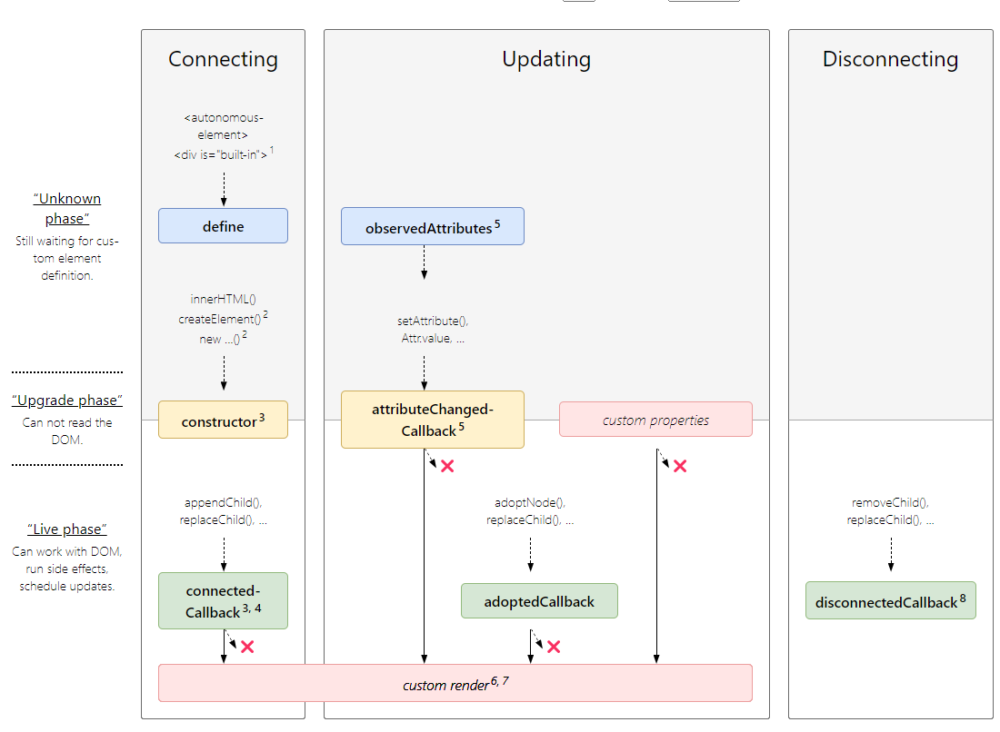

# 재사용성을 높일 수 있는 Custom elements

리액트에서 재사용성을 높이기 위해서 사용하는 컴포넌트처럼  자바스크립트에서 custom element를 지원 해줍니다.

## Custom element 생성

custom element는 `CustomElementRegistry.define()` 메소드를 사용하여 `CustomElementRegistry` 에 등록할 수 있습니다. 

아래는 custom element를 생성하는데 필요한 규칙 입니다.

- custom element의 이름은 최소한 하나의 대시가 필요합니다. (kebab-case). e.g) my-element
- custom element는 `class` 객체를 통해서 등록할 수 있습니다. 그러므로 `class` 를 지원하지 않는 ES2015의 경우 Babel를 사용해야 합니다.
- (optional) custom element 등록에 `extends` 를 사용하여 HTML 기본 elemet를 상속받을 수 있습니다.

위의 3가지 규칙을 적용한 예 입니다.

```jsx
customElements.define('word-count', WordCount, { extends: 'p' });
```

element의 이름은 `word-count` 이며 `<p>` 를 상속 받았다는 것을 알 수 있습니다.

`WordCount` class는 아래와 같습니다.

```jsx
class WordCount extends HTMLParagraphElement {
  constructor() {
    // Always call super first in constructor
    super();

    // Element functionality written in here

    ...
  }
}
```

custom element에 사용되는 class는 element의 lifecycle를 가지고 있습니다.

위의 예제를 토대로 아래 예제를 보겠습니다.

[https://mdn.github.io/web-components-examples/popup-info-box-web-component/](https://mdn.github.io/web-components-examples/popup-info-box-web-component/)

```jsx
// Create a class for the element
class PopUpInfo extends HTMLElement {
  constructor() {
    // Always call super first in constructor
    super();

    // Create a shadow root
    const shadow = this.attachShadow({mode: 'open'});

    // Create spans
    const wrapper = document.createElement('span');
    wrapper.setAttribute('class', 'wrapper');

    const icon = document.createElement('span');
    icon.setAttribute('class', 'icon');
    icon.setAttribute('tabindex', 0);

    const info = document.createElement('span');
    info.setAttribute('class', 'info');

    // Take attribute content and put it inside the info span
    const text = this.getAttribute('data-text');
    info.textContent = text;

    // Insert icon
    let imgUrl;
    if(this.hasAttribute('img')) {
      imgUrl = this.getAttribute('img');
    } else {
      imgUrl = 'img/default.png';
    }

    const img = document.createElement('img');
    img.src = imgUrl;
    icon.appendChild(img);

    // Apply external styles to the shadow dom
		// of course, you can use external style sheet
    const linkElem = document.createElement('link');
    linkElem.setAttribute('rel', 'stylesheet');
    linkElem.setAttribute('href', 'style.css');

    // Attach the created elements to the shadow dom
    shadow.appendChild(linkElem);
    shadow.appendChild(wrapper);
    wrapper.appendChild(icon);
    wrapper.appendChild(info);
  }
}

// Define the new element
customElements.define('popup-info', PopUpInfo);
```

## Custom Element lifecycle callbacks

아래 4가지 custom element lifecycle callback을 정의 할 수 있습니다.

- `connectedCallback` : custom element가 document에 연결될 때 호출됩니다
- `disconnectedCall` : custom element가 document와의 연결이 끊어질 때 호출됩니다.
- `adoptedCallback` : custom element가 새로운 document로 이동될 때 호출 됩니다. `adopteNode()` 로 인해서 발생
- `attributeChangedCallback` : custom element의 attribute가 생성, 제거 또는 변경 시에 호출 됩니다. 특정 attribute에 대해서 관리하고 싶다면 `observedAttributes` 메소드를 사용할 수 있습니다.



위의 정의를 토대로 아래 예제를 보겠습니다.

[https://mdn.github.io/web-components-examples/life-cycle-callbacks/](https://mdn.github.io/web-components-examples/life-cycle-callbacks/)

```jsx
// Create a class for the element
class Square extends HTMLElement {
  // Specify observed attributes so that
  // attributeChangedCallback will work
  static get observedAttributes() {
    return ['c', 'l'];
  }

  constructor() {
    // Always call super first in constructor
    super();

    const shadow = this.attachShadow({mode: 'open'});

    const div = document.createElement('div');
    const style = document.createElement('style');
    shadow.appendChild(style);
    shadow.appendChild(div);
  }

  connectedCallback() {
    console.log('Custom square element added to page.');
    updateStyle(this);
  }

  disconnectedCallback() {
    console.log('Custom square element removed from page.');
  }

  adoptedCallback() {
    console.log('Custom square element moved to new page.');
  }

  attributeChangedCallback(name, oldValue, newValue) {
    console.log('Custom square element attributes changed.');
    updateStyle(this);
  }
}

customElements.define('custom-square', Square);

function updateStyle(elem) {
  const shadow = elem.shadowRoot;
  shadow.querySelector('style').textContent = `
    div {
      width: ${elem.getAttribute('l')}px;
      height: ${elem.getAttribute('l')}px;
      background-color: ${elem.getAttribute('c')};
    }
  `;
}

const add = document.querySelector('.add');
const update = document.querySelector('.update');
const remove = document.querySelector('.remove');
let square;

update.disabled = true;
remove.disabled = true;

function random(min, max) {
  return Math.floor(Math.random() * (max - min + 1) + min);
}

add.onclick = function() {
  // Create a custom square element
  square = document.createElement('custom-square');
  square.setAttribute('l', '100');
  square.setAttribute('c', 'red');
  document.body.appendChild(square);

  update.disabled = false;
  remove.disabled = false;
  add.disabled = true;
};

update.onclick = function() {
  // Randomly update square's attributes
  square.setAttribute('l', random(50, 200));
  square.setAttribute('c', `rgb(${random(0, 255)}, ${random(0, 255)}, ${random(0, 255)})`);
};

remove.onclick = function() {
  // Remove the square
  document.body.removeChild(square);

  update.disabled = true;
  remove.disabled = true;
  add.disabled = false;
};
```

## Libraries

위의 custom element 사용을 용이하게 해주는 다양한 라이브러리가 있습니다.

[FASTElement](https://www.fast.design/docs/fast-element/getting-started/), [snuggsi](https://github.com/devpunks/snuggsi), [X-Tag](https://x-tag.github.io/), [Slim.js](https://slimjs.com/), [Lit](https://lit.dev/), [Smart](https://www.htmlelements.com/), [Stencil](https://stenciljs.com/), [hyperHTML-Element](https://github.com/WebReflection/hyperHTML-Element), [DataFormsJS](https://www.dataformsjs.com/),  [Custom-Element-Builder](https://tmorin.github.io/ceb/)